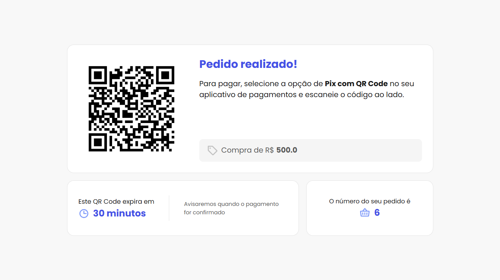
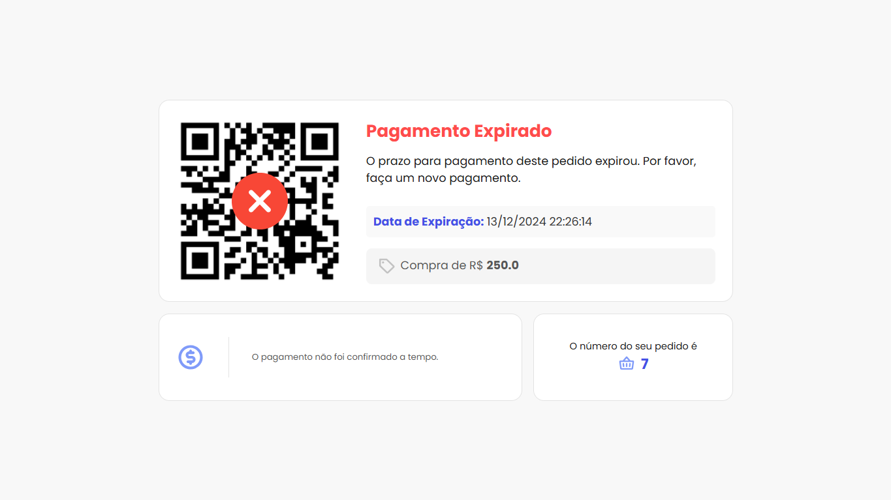

# 💳 Pagamento em Tempo Real com Flask e WebSockets

Este projeto simula um sistema de pagamento em tempo real utilizando **Flask**, **Python** e **WebSockets**. O sistema permite a criação de pagamentos via Pix, confirmação de pagamento, monitoramento de pagamentos expirados e atualização em tempo real via **WebSockets** para os clientes conectados. 💳🔄



<!-- <p align="center">
    
</p>
<p align="center">
    
    
</p> -->

## 🛠️ Tecnologias Utilizadas

- 🐍 **Flask**: Framework web para Python.
- 🌐 **WebSockets (via Flask-SocketIO)**: Comunicação em tempo real entre o servidor e o cliente.
- 🗄️ **SQLite**: Banco de dados relacional para armazenar informações sobre os pagamentos.
- ⏰ **Flask-APScheduler**: Agendador para verificar pagamentos expirados periodicamente.

## ⚙️ Funcionalidades

- 🖼️ **Criação de pagamentos Pix:** Gera um pagamento com valor especificado e cria um QR Code único.
- ✅ **Confirmação de pagamentos:** Valida o pagamento com base no valor e no `bank_payment_id`.
- ⏳ **Monitoramento de pagamentos expirados:** Detecta automaticamente pagamentos que ultrapassaram o tempo limite.
- 📡 **Notificações em tempo real:** Envia atualizações de eventos como pagamentos confirmados ou expirados via WebSockets.
- **Páginas de status do pagamento:**
  - 📄 Página de pagamento com QR Code para transações pendentes.
  - ⌛ Página de pagamento expirado com detalhes.
  - 🎉 Página de pagamento confirmado com informações detalhadas.

## 🔧 Instalação

1. **Clone o repositório:**

    ```bash
    git clone https://github.com/joschonarth/flask-payment-api.git
    ```

2. **Crie um ambiente virtual:**

    ```bash
    python -m venv .venv

    source .venv/bin/activate  # Linux/Mac
    .venv\Scripts\activate     # Windows
    ```

3. **Instale as dependências:**

    ```bash
    pip install -r requirements.txt
    ```

4. **Inicie o servidor Flask:**

    ```bash
    python app.py
    ```

🌐 O servidor estará rodando em [http://127.0.0.1:5000](http://127.0.0.1:5000).

## 🔗 Endpoints

### 💳 Criar Pagamento Pix

- **Descrição:** Cria um pagamento Pix com valor e gera um QR Code para pagamento.
- **Método:** `POST`
- **URL:** `/payments/pix`
- **Body:**

```json
{
    "value": 500
}
```

- **Response:**

```json
{
    "message": "The payment has benn created",
    "payment": {
        "bank_payment_id": "7cc9275c-b511-49b2-9211-d4a6526ae619",
        "expiration_date": "Fri, 13 Dec 2024 22:17:08 GMT",
        "id": 6,
        "paid": false,
        "qr_code": "qr_code_payment_7cc9275c-b511-49b2-9211-d4a6526ae619",
        "value": 500.0
    }
}
```

### 🖼️ Obter QR Code do Pagamento Pix

- **Descrição:** Recupera a imagem do QR Code gerado para um pagamento.
- **Método:** `GET`
- **URL:** `/payments/pix/qr_code/<file_name>`

### ✅ Confirmar Pagamento Pix

- **Descrição:** Confirma o pagamento de um Pix quando o valor e o bank_payment_id forem validados.
- **Método:** `POST`
- **URL:** `/payments/pix/confirmation`
- **Body:**

```json
{
    "bank_payment_id": "360286a2-6bc5-4a6e-b16b-251429b43b98",
    "value": 500
}
```

- **Response:**

```json
{
    "message": "The payment has benn confirmed"
}
```

## ⚡ Funcionalidades de WebSocket

- **Conectar ao servidor WebSocket:** Ao conectar-se, o cliente recebe notificações em tempo real de eventos como pagamentos confirmados e pagamentos expirados. 🔔

- **Eventos emitidos:**
    - `payment-confirmed-{payment_id}`: Quando um pagamento é confirmado. ✅
    - `payment-expired-{payment_id}`: Quando um pagamento expira. ⏰


## ⏰ Agendamento de Verificação de Pagamentos Expirados

A cada 1 minuto, o sistema verifica pagamentos que não foram confirmados e estão expirados. Se algum for encontrado, um evento `payment-expired-{payment_id}` é emitido. 🔄


## 🧪 Como Testar

1. **Criação de um pagamento Pix:** Envie um `POST` para `/payments/pix` com um valor e obtenha o QR Code. 📱

2. **Confirmação do pagamento:** Envie um `POST` para `/payments/pix/confirmation` com o `bank_payment_id` e o valor. 💸

3. **Verificação do status de pagamento:** Acesse a URL `/payments/pix/<payment_id>` para ver se o pagamento foi confirmado ou expirou. 🔍

## 🤝 Contribuições

Sinta-se à vontade para abrir issues ou pull requests com melhorias ou correções. 🚀

## 📞 Contato

<div>
    <a href="https://www.linkedin.com/in/joschonarth/" target="_blank"></a>
    <a href="mailto:joschonarth@gmail.com" target="_blank"></a>
</div>